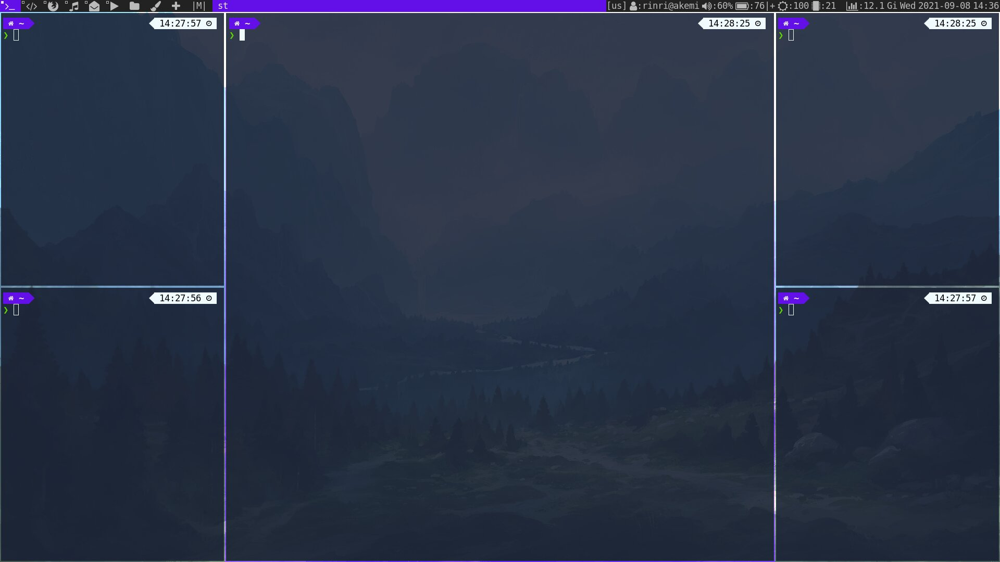

# My dwm build



Patches:

- alwaysontop
- cool-autostart
- center
- centeredmaster
- fullgaps
- swallow

Autostart:

```c
static const char *const autostart[] = {
    "sh", "-c", "sh ~/scripts/xinit.sh", NULL,
    "dunst", NULL,
    "slstatus", NULL,
    NULL /* terminate */
};
```

I use `dunst` notification manager, `slstatus` statusbar, `picom` and font awesome. Install them first. I recommend to install `ttf-font-awesome-4` from AUR if your icons look small.

Build:

```bash
cp config.def.h config.h
sudo make install
```

dwm's README:

# dwm - dynamic windows manager

dwm is an extremely fast, small, and dynamic window manager for X.

# Requirements

In order to build dwm you need the Xlib header files.

# Installation

Edit config.mk to match your local setup (dwm is installed into
the /usr/local namespace by default).

Afterwards enter the following command to build and install dwm (if
necessary as root):

```bash
    make clean install
```

# Running dwm

Add the following line to your .xinitrc to start dwm using startx:

```bash
    exec dwm
```

In order to connect dwm to a specific display, make sure that
the DISPLAY environment variable is set correctly, e.g.:

```bash
    DISPLAY=foo.bar:1 exec dwm
```

(This will start dwm on display :1 of the host foo.bar.)

In order to display status info in the bar, you can do something
like this in your .xinitrc:

```bash
    while xsetroot -name "`date` `uptime | sed 's/.*,//'`"
    do
    	sleep 1
    done &
    exec dwm
```
